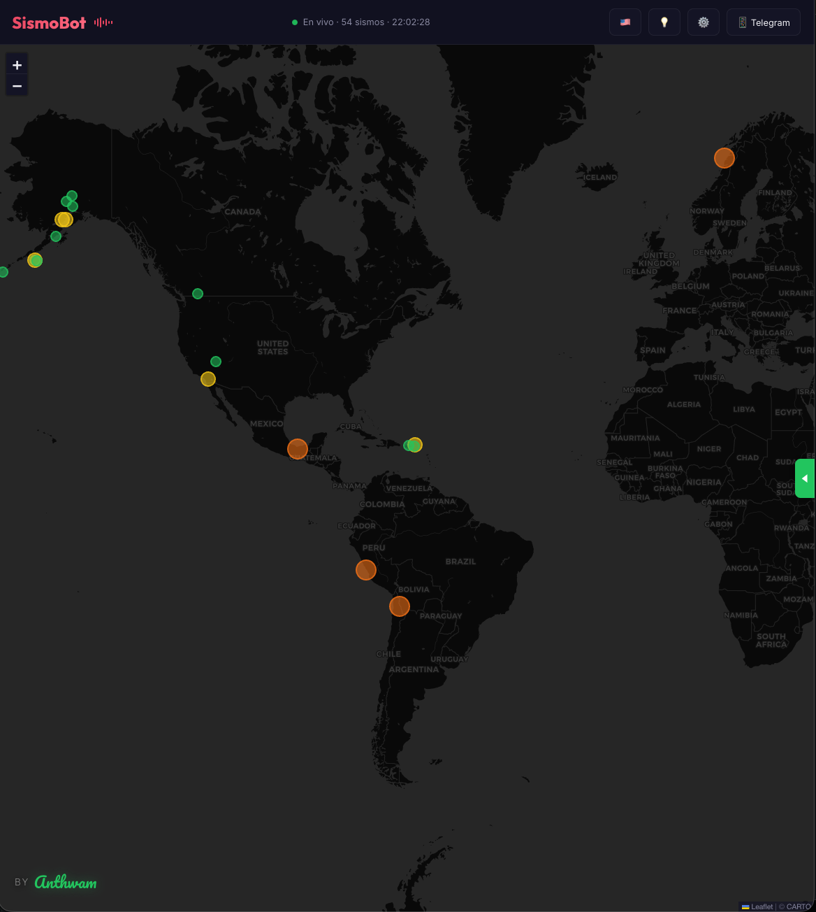

# SismoBot 🌍⚡



**SismoBot** is a comprehensive, real-time seismic alert system designed to monitor and notify users about earthquakes globally. It combines a highly interactive Progressive Web App (PWA) with a dedicated Telegram bot (`@Sismove_bot`) to ensure you receive critical alerts wherever you are.

## 🚀 Core Features

### 🗺️ Interactive Real-Time Map (PWA)
- **Live Data Sources**: Connects directly to official seismic networks including USGS (United States Geological Survey) and EMSC (European-Mediterranean Seismological Centre) to fetch up-to-the-minute data.
- **Visual Magnitude Indicators**: Earthquakes are plotted on a sleek, dark-themed Leaflet map. Markers are color-coded based on the magnitude of the tremor.
- **High-Intensity Alerts**: Severe earthquakes trigger a custom CSS "scratch-shake" animation and a red pulsing shadow across the map, ensuring high-priority events grab your attention immediately.
- **Bilingual Interface**: Fully localized in both English and Spanish (`react-i18next`), adapting automatically to the user's browser language with a manual toggle available.
- **Interactive Guided Tour**: New users are welcomed with an automated, step-by-step interactive guide (powered by `driver.js`) that explains how to use the map, the event feed, and the notification settings.

### 🔔 Custom Push Notifications
- Users can subscribe to Web Push Notifications directly from their browser.
- **Smart Filtering**: Configure your alerts based on your preferences. You can filter by minimum magnitude and select specific world regions (e.g., Latin America, North America, Europe, Asia, or Global).

### 📱 Telegram Bot Integration
- For users who prefer instant messaging, SismoBot integrates with a dedicated Telegram bot.
- Provides a seamless alternative to browser push notifications, delivering critical alerts directly to your phone.

## 🛠 Tech Stack
- **Frontend**: React 19, TypeScript, Vite
- **Mapping**: Leaflet, React-Leaflet
- **Styling**: Custom CSS with Dark Mode, dynamic keyframe animations, and custom UI components
- **Backend / Database**: Neon Serverless Postgres
- **Internationalization**: `i18next` & `react-i18next`
- **Tours**: `driver.js`

## 📦 Getting Started (Local Development)

1. Clone the repository:
   ```bash
   git clone git@github.com:1Terabit/SismoBot.git
   ```
2. Navigate to the PWA directory:
   ```bash
   cd SismoBot/pwa
   ```
3. Install dependencies:
   ```bash
   pnpm install
   ```
4. Start the development server:
   ```bash
   pnpm dev
   ```

---
*Created with ❤️ By Anthwam*

## 📄 License

This project is licensed under the [GNU Affero General Public License v3.0 (AGPLv3)](LICENSE).
